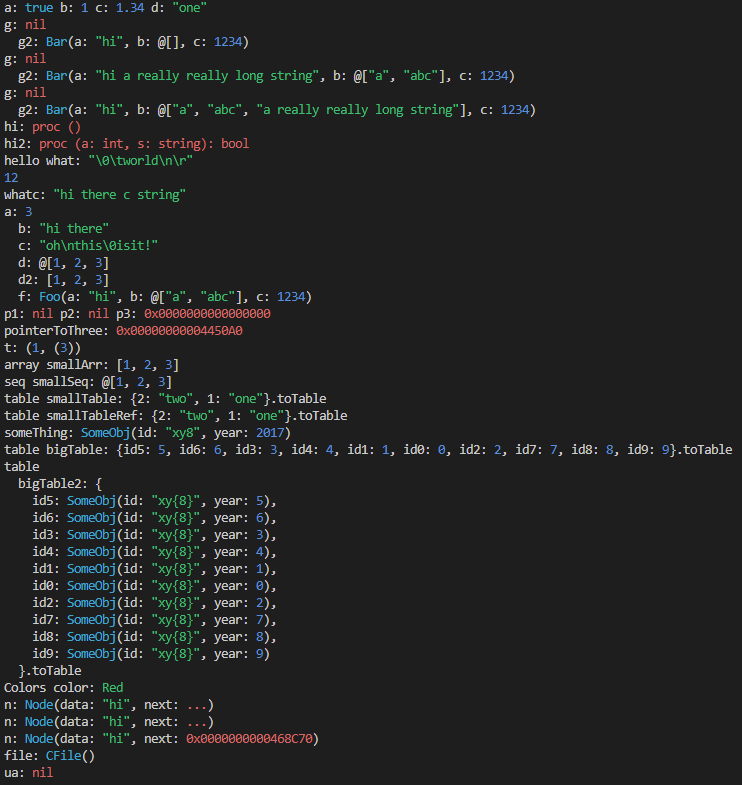

# Pretty - a pretty printer for Nim types.

`nimble install pretty`


[API reference](https://treeform.github.io/pretty)

This library has no dependencies other than the Nim standard library.

This is a rewrite of the now deprecated [print](https://github.com/treeform/print).

## About

You wanna print-debug like a boss? Then ditch that `echo` and use pretty `print` instead. This bad boy spits out object info in that sweet "Nim way" with syntax highlighting! Plus, it don't matter what kinda crazy sh*t you throw at it - refs, pointers, cycles, you name it - pretty will manage.

```nim
import pretty

let a = 3
print a
```
```nim
a: 3
```

## The "Nim way"

Pretty don't just print your data structures - it spits 'em out in the exact same format you'd use to create 'em in your Nim source code. It's like magic, man. You can literally copy and paste that output back into your code and it'll compile like a charm in most cases. Its very important 'cause you gotta be able to get back what you put in.

```nim
let
  a = 3
  b = "hi there"
  c = "oh\nthis\0isit!"
  d = @[1, 2, 3]
  d2 = [1, 2, 3]
  f = Foo(a:"hi", b:@["a", "abc"], c:1234)

print a, b, c, d, d2, f
```
```nim
a: 3 b: "hi there" c: "oh\nthis\0isit!" d: @[1, 2, 3] d2: [1, 2, 3] f: Foo(a: "hi", b: @["a", "abc"], c: 1234)
```

## Syntax highlighting

Screenshot from VS Code:



Pretty only applies fancy colors when it detects a terminal. If you pipe the output of your program to a file or another command, it will output plain text.

## Smart indention

Pretty attempts to print everything in a single line, but if the output exceeds the maximum width of the current terminal, it will create indentation levels for improved readability. The maximum width is determined based on the maximum width of the current terminal.

```nim
let g2 = Bar(a: "hi a really really long string", b: @["a", "abc"], c: 1234)
print g2
```

```nim
g2: Bar(
  a: "hi a really really long string",
  b: @["a", "abc"],
  c: 1234
)
```

## Stuff `echo` does not do well

If you've used Nim before, you know that printing refs is a real pain in the butt. Nim will complain that there's no $ operator, even though it already knows how to print them. And even if you do create a $ operator for your ref object, you still have to handle nils and cycles yourself!

That's where pretty comes in clutch. It can print nils, refs, and pointers like a true champ, no sweat.

```nim
g2=Bar(
  a: "hi a really really long string",
  b: @["a", "abc"],
  c: 1234
)
```

```nim
let
  p1: ptr int = nil
  p2: ref Foo = nil
print p1, p2
```
```nim
p1: nil p2: nil
```

```nim
var three = 3
var pointerToThree = cast[pointer](addr three)
print pointerToThree
```
```nim
pointerToThree: 0x00000000004360A0
```

```nim
type Node = ref object
  data: string
  next: Node
var n = Node(data:"hi")
n.next = n
print n
```
```nim
n: Node(data: "hi", next: ...)
```

## Pretty also does Tables, Sets and even Json!

You got that straight! Pretty is aware of common data types that would normally print out all messy with their internals exposed. But when it comes to `HashTable`, `HashSet`, or `JsonNode`, it knows how to print them out in a neat and tidy fashion. No ugly internals to be found here!

```nim
let json = %*{
  "a": 123,
  "b": "hi",
  "c": true
}
print json
```

```nim
json: {a: 123, b: "hi", c: true}
```

## It also does `procs`

```nim
proc adder(a, b: int): int = a + b
print adder
```
```nim
adder: proc (a: int, b: int): int
```

## Pretty tables

Pretty also has the ability to print data as tables, which can often be a more natural and intuitive way to display information compared to nested data structures. Pretty cool!

```nim
type
  Mob = object
    name: string
    hp: int
    x: float
    y: float
    mode: char
var mobs = @[
  Mob(name:"Boyar Dens", hp: 120, x:1.2, y:2.33333, mode:'a'),
  Mob(name:"Kozar\0", hp: 20, x:21.23, y:2.3),
  Mob(name:"Goffer", hp: 25, x:31.2, y:2.3),
  Mob(name:"Hexer the Great", hp: 0, x:41.2, y:122.3, mode:'b'),
]
printTable mobs
```


